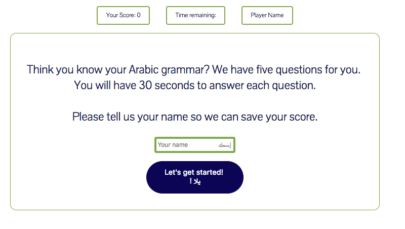

# 

Arabic Grammar Quiz

As a user, I should be able to:
1. Click through 5 trivia questions on basic Arabic grammar concepts.
2. Have each question tell me if I selected the correct or incorrect answer
3. See my score in the top left corner of the screen as I progress through the quiz
5. See how much time I have left to answer each question - counting down from 30 seconds for each questions
6. See my final score and points for improvement based on my answers

Technologies Used:

1. HTML5
2. CSS
3. JavaScript

Approach taken:

1. Created 5 unique questions as objects in an array, stored as a global variable
2. Created a function that would store user name
3. Created a timer function that would give the user 30 seconds to answer each question. After this time elapses, the game automatically advances to the next question.
4. Created 3 separate functions to:
	a. Set the question (using the index of the questions array set as a global variable)
	b. Register the user answer selection and compare it to the correct answer in the question's object.
	c. Update the user's score based on correct/incorrect answers/
	d. Provide user their final score as well as specific grammar concepts to focus on based on their incorrect answers.
